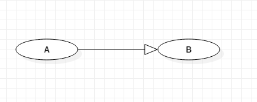
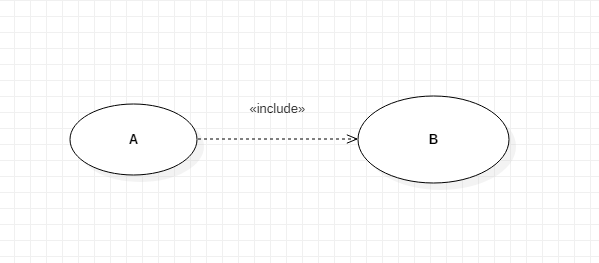
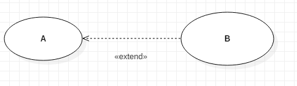

Inżynieria oprogramowania
===

## Wykład 1 - UML (Podstawy, Przypadki użycia)

- Program komputerowy - model fragmentu rzeczywistości
- Język programowania - model modelu -  *metamodel*

### Perspektywy:

- Perspektywa przypadków użycia
  - opisuje zachowanie systemu z punktu widzenia użytkownika, analityka, testera.
  - Najbardziej abstrakcyjna perspektywa.
  - Nie można uzyskać kodu
- Perspektywa projektowa
  - Na bazie pers. przypadków użycia.
  - Opis klas, interfejsów, sekwencji i kooperacji.
  - Opis problemu i jego rozwiązanie
  - Można uzyskać kod
- Perspektywa procesowa
  - Tworzenie wątków i procesów w systemie
- Perspektywa implementacyjna
  - Opisuje komponenty i artefakty potrzebne do scalenia i fizycznego udostępnienia systemu.
  - Konfiguracja poszczególnych wersji systemu.
- Perspektywa wdrożeniowa
  - Związek między softwarem a hardwarem

###  Przypadki użycia:

- Wymagania stawiane systemowi przez użytkownika
- Przypadek użycia jest dobrze określoną interakcją między użytkownikiem a systemem
- Dziedziczenie przypadku użycia:



Zwrot skierowany w stronę bytu niezależnie logicznego

- Przebieg podstawowy: Po A **zawsze** występuje B



- Przebieg opcjonalny: B **czasami** rozszerza A



### Aktorzy:

- Osoby wchodząca w interakcję z
  - systemem
  - systemami wewnętrznymi
  - cześciami systemu, które mają wpływ na funkcjonowanie systemu, ale nie mogą być zmieniane przez system
- Rozpoznawanie aktorów:
  - Kto będzie używał podstawowych funkcji?
  - Kto wymaga wspomagania w pracy i przy których zadaniach?
  - Kto jest adminem i utrzymuje system?
  - Jakimi urządzeniami steruje system?
  - Z jakimi systemami system ma współpracować?
  - Kto jest zainteresowany rezultatem działania?

Diagramy przypadków mogą być ogólne i szczegółowe.

## Wykład 2 - UML (Diagramy klas)

- Dane zdefiniowane w klasie to atrybuty
- funkcje składowe to operacje

Przykład deklaracji klasy:

```csharp
public class Klasa
{
    private object atrubut;
    public void Operacja();
}
```

### Ikona klasy UML dzieli się na 3 główne obszary:

- Nazwa klasy - musi być unikalna
- Lista atrybutów
- Lista operacji
- class responsibility (opcjonalnie)

#### Typy operacji:

- `<<constructor>>`, `<<ctor>>`, `<<create>>`
- `<<destructor>>`, `<<dtor>>`, `<<destroy>>`
- `<<update>>` - zmiana stanu obiektu
- `<<query>>` - nie zmienia stanu obiektu

#### Atrybuty statyczne:

- private '-'
- public '+'
- protected '#'
- package '~'

### Deklaracja atrubutu w klasie:

Zazwyczaj opisywany przez nazwę i typ
> [widocznosc] nazwa_atrybutu : typ[liczebnosc] {ograniczenia} = wartosc_domyslna

- {ordered} - obiekty są uporządkowane
- {unordered} - nieuporządkowane
- {unique}
- {nonunique}
- {readOnly}
- {frozen} - readOnly po pierwszym zapisie

### Deklaracja operacji w klasie:

