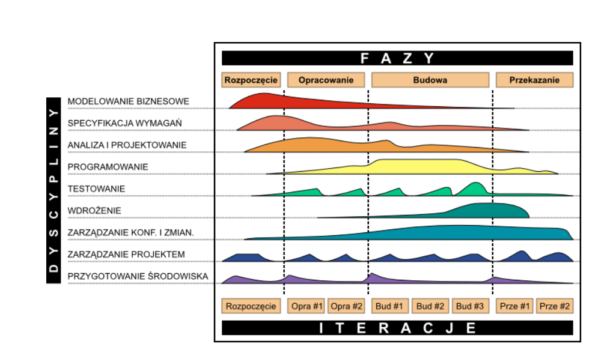

Inżynieria oprogramowania
===

## RUP

### Zasady RUP

- Iteracyjnie i przyrostowo tworzenie oprogramowania
- Zarządzanie wymaganiami
- Sterowane ryzykiem i priorytetami
- Graficzne projektowanie oprogramowania
- Kontrola jakości oprogramowania
- Proces kontroli zmian w oprogramowaniu
- Używanie architektury bazującej na komponentach
    - Ułatwiające integrację całości kodu i dostosowywanie do zmiennych wymagań
    - Integracja poszczególnych części systemu przebiega stopniowo, podzielona jest na kilka etapów

- Cykl wytwórczy jest charakterystyczny, bo pokazuje procesy w dwóch płaszczyznach.
- W pionie przedstawione są statyczne aspekty wytwarzania oprogramowania.
- W poziomie przedstawione są dynamiczne aspekty.

### Fazy tworzenia oprogramowania

#### Rozpoczęcie

- Określenie założeń przedsięwzięcia
- Założenia techniczne, rynkowe i ekonomiczne
- Tworzony jest harmonogram prac
- Szacowanie ryzyka powodzenia projektu
- Określenie celów przedsięzwięcia

#### Opracowanie

- Analiza dziedziny problemu
- Zdefiniowanie architektury
- Przygotowanie planu prac
- Neutralizacja największych zagrożeń

#### Budowanie

- W sposób iteracyjny i przyrostowy następuje budowanie oraz integrowanie wszystkich komponentów
- Końcowym produktem tej fazy jest gotowy, w pełni przetestowany oraz udokumentowany program

#### Przkazanie

- Przekazanie użytkownikowi gotowego systemu
- W tej fazie wychodzą na światło nieprzewidzane problemy z systemem, które często wymagają dodatkowej pracy programistycznej.
- Po dopracowaniu rozwiązania następuje produkcja systemu, która kończy proces wytwarzania oprogramowania

#### Czasochłonność etapów

- Rozpoczęcie: 10%
- Opracowanie: 30%
- Budowanie: 50%
- Przekazanie: 10%

### Dyscypliny

#### Podstawowe

- __Modelowanie biznesowe__ - zawiera wizję nowej, docelowej organizacji, definicji występujących w ramach jej procesów, ról i zakresów odpowiedzalności
- __Specyfikacja wymagań__ - oznacza opracowanie wizji systemu, modelu przypadków użycia i zdefiniowania wymagań niefunkcjonalnych
- __Analiza i projektowanie__ - zawiera analizę i projekt systemu z wykorzystaniem całego spektrum diagramów UML
- __Implementacja__ - pozwala na opracowanie kodu źródłowego w wybranym języku programowania oraz kompilację kodu i integrację komponentów
- __Testowanie__ - oznacza planowanie testów oraz ocenę systemu poprzez wykonanie szeregu testów
- __Wdrożenie__ - dotyczy instalacji oprogramowania systemu i formalną akceptację kolejnych wersji systemu przez klienta czy użytkownika

#### Wspomagające

- __Zarządzanie konfiguracją i zmianami__ - obejmuje kontrole wesji artefaktów opracowanych podczas kolejnych iteracji
- __Zarządzanie projektem__ - oznacza planowanie i kontrolę realizacji projektu
- __Organizacja środowiska__ - obejmuje przygotowanie infrastruktury dla skutecznej realizacji projektu

#### Zalety RUP

- Może być z powodzeniem wykorzystany w postaci "as is" dla małych i średnich organizacji
- Przykrywa całość cyklu życiowego SI
- Wykorzystuje najnowsze trendy i technologie: obiektowe podejście, architektura oparta na kompontach
- Jest ulepszany i rozwijany
- Posiada "solidną" architekturę, która może być przystosowana do konkretnych potrzeb użytkownika
- Posiada całą paletę wspierających narzędzi

## Scrum

- Motoda wywodząca się z Agile
- Określa zasady postępowania dla zespołu
- Nie opisuje ani nie podpowiada jak należy zbudować organizację, by Scrum działał w niej dobrze

### Role w Scrumie

#### Product Owner

- Posiada wizję produktu
- Określa kolejność realizacji zadań

#### Scrum Master

- Skupia się na działaniu zespołu
- Pomaga zwiększyć efektywność współpracy

#### Scrum Team

- W jego skład wchodzą wszyscy specjaliści niezbędni do wykonania zadania (nie tylko programiści)
- Źródłem wymagań jest backlog produktu

### Proces Scrum

- Zespół dostarcza kolejne wersje działającego produktu w krótkich cyklach zwanych Sprintami
- Sprint jest ograniczony czasowo i trwa maksymalnie miesiąć
- Krótka długość sprintu gwarantuje produkt ownerowi, że gdy zdarzy się coś złego, to nie straci więcej czasu niż długość spritu
- Zespół razem PO ustala co dokładnie znaczy, że produkt działa

- Produkt Owner umieszcza listę wszystkich potrzeb w Backlogu Produktu w kolejności od najważniejszej
- Zespół na początku sprintu ustala co jet w stanie dostarczyć z Backlogu Produktu (Planowanie Sprintu - Sprint Planning)
    - Nie powinno trwać dłużej niż jeden dzień
    - Plan realizacji zadań nazywamy __Sprint Backlog__
- Codziennie zespół spotyka się na któtkie (15 min) spotkanie, by omówić postęp prac itp. (__Daily SCRUM__)
- Zespół przygotowuje się do następnego Sprintu poprzez __Porządkowanie Backlogu produktu__
- Po zakończeniu Sprintu odbywa się __Sprint Review__, gdzie zespół wraz z PO pokazuje co stworzył w trakcie Sprintu, żeby zebrać feedback od przyszłych użytkowników itp.
- Następnie w swoim gronie w trakcie __Sprint Retrospective__ zespół ustala jak może pracować skuteczniej
