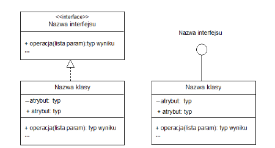
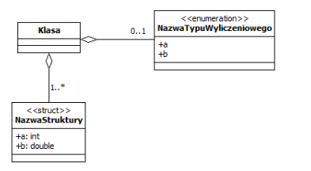
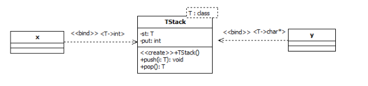

Inżynieria oprogramowania
===

## Wykład 1 - UML (Podstawy, Przypadki użycia)

#### Model

- Pewien zbiór ogólnych założeń, pojęć i zależności
- Celem modelu jest stworzenie poprawnej abstakcji rzeczywistego świata
- Tworzony dla lepszego zrozumienia dziedziny problemu oraz umożliwienia wymiany informacje w trakcie jego rozwiązywania
- Podstawa komunikacji pomiędzy podmiotami zainteresowanymi danym problemem

- Program komputerowy - model fragmentu rzeczywistości
- Język programowania - model modelu -  *metamodel*

#### Model dziedziny problemu

- Poprawna abstracja rzeczywistego świata
- Powinien być możliwie mało skąplikowany, ale powinien poprawnie odzwierciedlać świat rzeczywisty

#### UML

- Służy do budowania dobrych i ogólnych modeli
- Nie należy traktować do w sposób przesadnie ścisły
- Nigdy całkowicie nie opisuje bytów rzeczywiście istniejących
- Jego głównym zadaniem jest definiowanie, konstruowanie, obrazowanie i dokumentaowanie cześci składowych systemu komputerowego
- Zawiera zbiór symboli w postaci elementów graficznych, przy pomocy których można tworzyć bardziej złożone wyrażenia w postaci diagramów
- Celem diagramów jest zobrazowanie wielu perspektyw projektowanego systemu

### Perspektywy

- Perspektywa przypadków użycia
  - opisuje zachowanie systemu z punktu widzenia użytkownika, analityka, testera.
  - Zawiera elementy statyczne jak dynamiczne
  - Diagramy: Przypadków użycia, przebiegu, kooperacji, stanów, czynności
  - Najbardziej abstrakcyjna perspektywa.
  - Nie można uzyskać kodu
- Perspektywa projektowa
  - Na bazie pers. przypadków użycia.
  - Opis klas, interfejsów, sekwencji i kooperacji.
  - Diagramy klas, interakcji, stanów i czynności
  - Opis problemu i jego rozwiązanie
  - Można uzyskać kod
- Perspektywa procesowa
  - Tworzenie wątków i procesów w systemie
- Perspektywa implementacyjna
  - Opisuje komponenty i artefakty potrzebne do scalenia i fizycznego udostępnienia systemu.
  - Konfiguracja poszczególnych wersji systemu.
- Perspektywa wdrożeniowa
  - Związek między softwarem a hardwarem
  - Diagramy wdrożenia

### Przypadki użycia

- Wymagania stawiane systemowi przez użytkownika
- Przypadek użycia jest dobrze określoną interakcją między użytkownikiem a systemem
- Odwzorowuje funckje systemu w sposób jaki będą je widzieć przyszli użytkowinicy.
- Jego podstawowym zastosowaniem jest dialog z przyszłym użytkownikiem systemu zmierzający do sformułowania poprawnych wygamań odnośnie funkcjonowania systemu.

- Dziedziczenie przypadku użycia:


Zwrot skierowany w stronę bytu niezależnie logicznego

- Przebieg podstawowy: Po A **zawsze** występuje B


- Przebieg opcjonalny: B **czasami** rozszerza A


### Aktorzy

- Osoby wchodząca w interakcję z
  - systemem
  - systemami zewnętrznymi
  - cześciami systemu, które mają wpływ na funkcjonowanie systemu, ale nie mogą być zmieniane przez system
- Rozpoznawanie aktorów:
  - Kto będzie używał podstawowych funkcji?
  - Kto wymaga wspomagania w pracy i przy których zadaniach?
  - Kto jest adminem i utrzymuje system?
  - Jakimi urządzeniami steruje system?
  - Z jakimi systemami system ma współpracować?
  - Kto jest zainteresowany rezultatem działania?

Diagramy przypadków mogą być ogólne i szczegółowe.

## Wykład 2 - UML (Diagramy klas)

- Dane zdefiniowane w klasie to atrybuty
- Funkcje składowe to operacje

Przykład deklaracji klasy:

```csharp
public class Klasa
{
    private object atrybut;
    public void Operacja();
}
```

### Ikona klasy UML dzieli się na 3 główne obszary

- Nazwa klasy
    - musi być unikalna
    - Może być zapisana w formie prostej, lub poprzedzona nazwą pakietu (forma ścieżkowa)
- Lista atrybutów
- Lista operacji
- class responsibility (opcjonalnie)

#### Typy operacji

- `<<constructor>>`, `<<ctor>>`, `<<create>>`
- `<<destructor>>`, `<<dtor>>`, `<<destroy>>`
- `<<update>>` - zmiana stanu obiektu
- `<<query>>` - nie zmienia stanu obiektu

#### Specyfikatory dostępu

- private '-'
- public '+'
- protected '#'
- package '~'

### Deklaracja atrubutu w klasie:

Zazwyczaj opisywany przez nazwę i typ
> [widocznosc] nazwa_atrybutu : typ[liczebnosc] {ograniczenia} = wartosc_domyslna

- {ordered} - obiekty są uporządkowane
- {unordered} - nieuporządkowane
- {unique}
- {nonunique}
- {readOnly}
- {frozen} - readOnly po pierwszym zapisie

### Deklaracja operacji w klasie

> [widocznosc] nazwaOperacji : [(lista_parametrów)][:typ_wyniku] [właściwości]

lista parametrów:

> [tryb] nazwa : typ [ = wartosc_domyslna]

#### Tryby

- in - parametr wejściowy readOnly
- out - parametr wyjściowy - do modyfikacji
- inout - parametr wejściowy i wyściowy

#### Właściwości

- leaf - Funkcja niepolimorficzna (bez virtual)
- isQuery - nie zmiena stanu obiektu (const)
- sequantal, quarded, concurent - Operacja współbieżne

### Typy operacji

- Konstruktor
- Destruktor
- Mutator - np. settter (zmiena stan atrybutu)
- Akcesor - np. getter (odczyt wartości atrybutu)
- Iterator - pozwala na kolejna przetwarzanie wszystkich elementów struktury danych
- Finalizator - (W Javie i C# taki pseudo-destruktor)
- Operacja statyczna - (static) oznaczana jest na diagramie klas poprzez podkreślenie
- Własność - (Właściwości w C#)

### Klasy

- Konkretne - wszystkie operacje zostały zaimplementowane
- Polimorficzne - klasa, w której zdefiniowano jedną lub więcej operacji wirtualnych
- Abstrakcyjne - występuje jedna lub więcej operacji czysto wirtualnych (abstrakcyjnch)

- Metaklasa - klasa, która dysponuje specjalnym zestawem metod odpowiadającym podstawowym operacjom klasy np. sposób tworzenia obiektów, wyłowyłanie metod, stosowanie mechanizmów dziedzidzenia
- Aktywne - a dokładniej obiekty tych klas mogę być źródłem nowego procesu lub wątku.

### Związki Klas

#### Generalizacja

- "dziedziczenie" oznaczane strzałką z zamkniętym niezamalowanym grotem skierowanym w stronę bytu logicznie niezależnego.
- Związek między klasą bazową a klasą pochodną

#### Zależność

- na liście argumentów funkcji wystepuje odwołanie do innej klasy lub wskaźnik/referencja do niej
- w ciele funkcji składowej występuje zmienna/wskaźnik/referencja typu innej klasy
- typem powrotnym jest wskaźnik/obiekt innej klasy
- Oznaczana linią przerywaną zakończoną strzałką zwróconą w stronę klasy niezależnej
- `<<call>>` - operacja w klasie A wywołuje operacje z klasy B
- `<<create>>` - klasa A tworzy egzemplarz klasy B
- `<<instantiate>>` - obiekt klasy A jest egzemplarzem klasy B
- `<<use>>` - do zaimplementowanie klasy A jest wymagana klasa B
- `<<friend>>` - zależność klas zaprzyjaźnionych (c++ only)

#### Asocjacja (Powiązanie)

- obiekty jednego typu są połączone z obiektami innego typu poprzez atrybuty danych klas
- Zazwyczaj powiązanie działa w obie strony (jeśli nie zaznaczono inaczej)
- Klasa powiązana:
  - Forma przejściowa między dwoma klasami np. _zakup książki_ jest formą przejściową między _studentem_ a _książką_.
- Powiązania kwalifikowane
  - uzupełnia zwykłe powiązanie określając atrybuty decydujące o związku między klasami

#### Agregacja prosta

- Powiązanie całość-cześć
- oznaczamy symbolem pustego diamentu przy klasie zawierającej całość
- Klasa agregowana nie wpływa na życie klasy agregującej
- Klasa agregująca nie wpływa na życie klasy agregowanej

#### Agregacja całkowita (kompozycja)

- relacja wyłącznej własności.
- proces konstrukcji całości poprzedza skonstruowanie elementów składowych
- proces destrukcji całości poprzedza destrukcja elementów składowych
- oznaczamy symbolem wypełnionego diamentu po stronie całości

#### Liczebności

- Określa ile elementów danej klasy agreguje klasa agregująca

#### Klasy zagnieżdżone (zawierająca)

- Czyli klasa w klasie np. iterator

#### Interfejsy

- Wygląda prawie tak jak klasa
- Zawiera nazwę oraz stereotyp `<<interface>>`
- Zawiera tylko operacje, nie zawiera atrybutów



#### Typy wyliczeniowe



#### Template (Wzorce klas)

