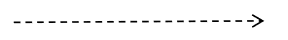
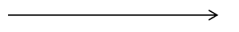

Inżynieria oprogramowania
===

## Wykład 3/4 - UML (Diagramy czynności, obiektów, stanów i sekwencji)

### Diagramy czynności

- Służą do sterowania przepływem czynności między wykonywanymi czynnościami
- To te przypominające schematy blokowe
- Wyróżniamy pole startowe oznaczone czarną kropką oraz pole końcowe (białe kółko z czarną kropką)

- Odbieranie i wysyłanie sygnału

- Obsługa wyjątków

- Wykonywanie ścieżki współbieżne

- Zakres odpowiedzialności

### Diagramy obiektów

#### Rodzaje obiektów

- obiekt nazwany
- obiekt anonimowy
- obiekt zawierający ścieżkę dostępu do pakietu z def. klasy
- obiekt osierocony
- obiekt aktywny

#### Wiązanie obiektów

#### Stereotypy wiązań

- `<<association>>` - jest widoczny dzięki temu wiązaniu
- `<<global>>` - jest w otaczającym zasięgu
- `<<local>>` - jest w lokalnym zasięgu
- `<<parameter>>` - obiekt jest widoczny ponieważ jest parametrem
- `<<self>>` - jest widoczny bo odebrał zlecenie wykonania danej operacji

### Diagramy stanów

- Czarne kółko oznacza wejście do stanu
- Białe kółko z czarną kropką oznacza wyjście ze stanu
- Przechowuje stan obiektu

- Przykład:

- Przejścia alternatywne:

### Diagramy sekwencji

- Inaczej diagramy przebiegu pozwalają modelować wzajemną interakcję obiektów w czasie.
- Obiekty mogą na siebie wzajemnie oddziaływać modyfikując stan (wartości) swoich atrybutów
- Żądanie wykonania operacji nazywane jest komunikatem
- Przetworzenie otrzymanego komunikatu powoduje zmianę stanu obiektu, a do obiektu źródłowego może przesłana być odpowiedź.
- Komunikaty mogą być blokujące (synchroniczne) albo nieblokujące (asynchroniczne)

- Komunikat synchroniczny:

- Komunikat zwrotny:

- Komunikat asynchroniczny:

- Przykładowy diagram sekwekcji:

- Rekurencja:

- Pętle:

### Diagramy komunikacji (kooperacji)

- Pozwalają na pokazanie kolejności wysyłania komunikatów

- Diagramy te pozwalają wymodelować interakcję zachodzącą między obiektami lub/i pomiędzy użytkownikiem systemy i obiektami.

### Komponenty

- wymienna część systemu implementująca jedną lub większą liczbę klas
- Wszystkie fizyczne pliki określane są mianem __artefaktów__
