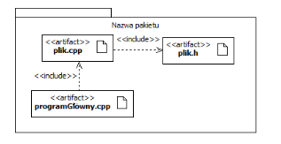
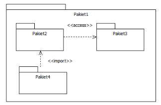
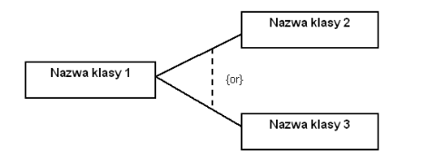

Inżynieria oprogramowania
===

## Wykład 5/6 - UML/OCL

### Relacja wyrażen (manifest) elementów logicznych przez elementy fizyczne

- Elementy logiczne są niezależne od elementów ligicznych, przez które są wyrażane.
- Artefakt zawierający definicję klasy (plik nagłówkowy) oznaczamy stereotypem `<<header>>`.
- Artefakt zawierający implementację klasy oznaczamy stereotypem `<<code>>`.

### Pakiety

- Służą do grupowania i systematyzowania składników modelu o podobnym przeznaczeniu we wspólnej przetrzeni nazw.

- Oprócz artefaktów w pakiety można grupować klasy, interfejsy, komponenty, operacje, przypadki użycia, diagrami i inne pakiety.
- Pakiety mogą udostępniać swoje elementy innym pakietom.
- Importować elementy z innych pakietów.

- Jeśli element jest widoczny tylko w obrębie macierzystego pakietu nazywamy go elementem prywatnym.
- Jeśli można do elementu uzyskać dostęp z zewnącz to taki element nazywamy publicznym.

### Diagramy wdrożenia

- Służą do zobrazowania fizycznej architektury projektowanego systemu.
- Podstawowym elementem diagramu jest węzeł.
- Przedstawienie architektury sprzętowej
    - `<<processor>>` - wykonuje kod programu lub komponentu
    - `<<device>>` - przyłączone do węzła i wspólpracuje z programem (np. drukarka)/
    - `<<pc server>>`, `<<pc client>>`, `<<user pc>>`
- Architektura programowa:
    - `<<artefact>>`
    - `<<executable>>`
    - `<<database>>`
    - `<<library>>`

### Mechanizmy rozszerzania

#### Mechanizny rozszerzające

- __stereotypy__ - umożliwiąją rozszerzania notacji UML.
- __notatki__ - umożliwiają rozszerzenie listy właściwości dowolnego bloku konstrukcyjnego UML.

- __metki__ - określa właściwości mające znaczenie podczas generacji kodu w opraciu o model.

- __ograniczenia__ - przedstawiane jako tekst w nawiasach klamrowych _{ }_ i może być umieszczany niemal w dowolnym miejscu diagramu umożliwiając rozszerzenie bloku konstrukcyjnego poprzez określenie warunków wywołania operacji, warunków wystepowania powiazań itp.

## Refaktoryzacja kodu

- Proces wprowadzania zmian w projekcie/programie, w wyniku krórych zasadniczo nie zmienia się funkcjonalność systemu.
- Jej celem jest utrzymanie odpowiedniej, wysokiej jakości organizacja struktury wewnętrzej systemu.
- Podejmuje się 2 główne typu działań:
    - Modyfikowanie elementów systemu w celu dostosowania ich do przyjętych standardów i/lub wzorców.
    - Poszukiwanie nowych standardów lub wzorców, które pojawiły się w systemie w trakcie jego rozwoju i ich precyzyjne definiowanie.
- Dzięki refaktoryzacji w systemie ogranicza się nadmiarowość kodu.

### DRY (Don't Repeat Yourself)

- Reguła zalecająca, aby w trakcie pisania programu separować często powtarzający się kod.
- Najczęściej stosowane mechanizmy:
    - Funkcje
    - Makra (C/C++)
    - Szablony
    - Używanie stałych
    - Podział kodu na moduły
    - Polimorfizm

### Klasyfikacja przekształceń według sposobu weryfikacji

- Przekształcenie proste
    - można je zweryfikować poprzez sprawdzenie określonych warunków początkowych i końcowych
    - np. przekszałcenia, których poprawność może być sprawdzona w trakcie kompilacji
- Przekształcenia o znanym zakresie testowania
    - wymagają przeprowadzenia określonych testów jednostkowych
- Przekształcenia o nieznanym zakresie testowania
    - także wymagają testowania, jednak nie można wskazać uniwersalnego zbioru testów do zweryfikowania ich poprawności

### Przekształcenia proste

- Poprawność można zweryfikować poprzez statyczną analizę zmienianego kodu oraz związane z przekształceniem warunków wstępnych i końcowych.
- Przekształcenia:
    - __Extract Method__ - wyciąga fragment kodu z rozbudowanego fragmentu i tworzy z niego nową metodę.
    - __Add Parameter__ - dodanie do sygnatury nowego parametru

### Przekształcenia o znanym zakresie testowania

- __Move Method__ - Przeniesienie metody z klasy do klasy
- __Change Undirectional Association to Bi-directional__ - zmiana polega, że oba obiekty będą posiadały odwołania do siebie nawzajem.
- __Remove Setter__ - usunięcie metod zmieniających stan obiektu.

### Przekształcenia o nieznanym zakresie testowania

- Przekształcenia o dużej złożoności, wprowadzące istotne zmiany w znacznej części budowanego systemu.