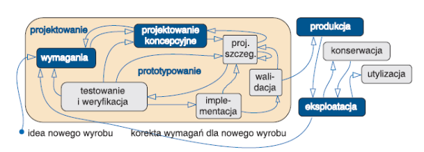
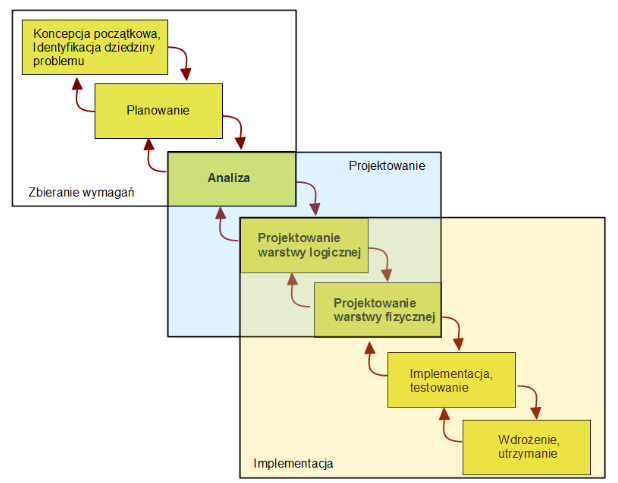
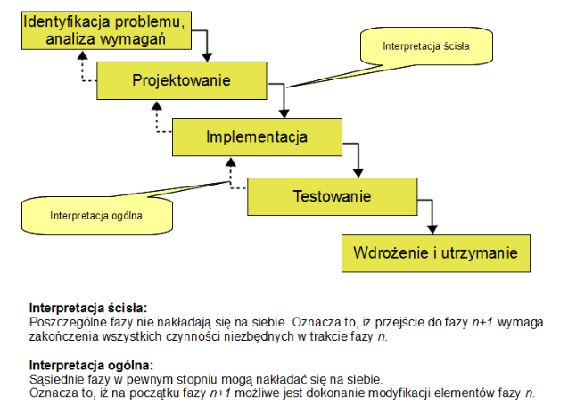
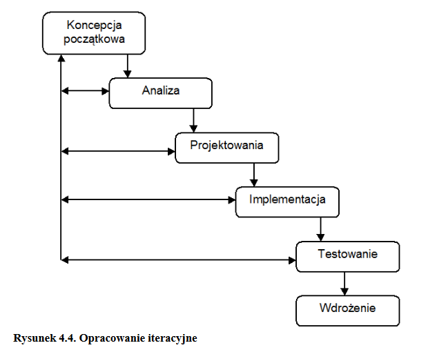
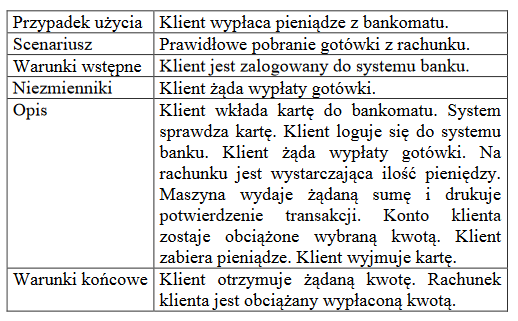
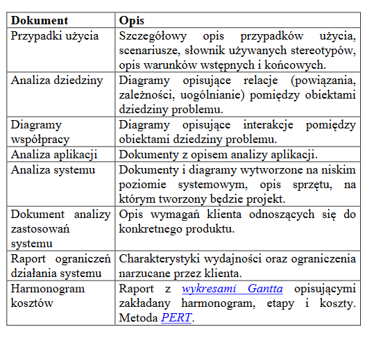

Inżynieria oprogramowania
===

# Wykład 7/8 Analiza, projektowanie i testowanie oprogramowania

- Celem projektanta jest przygotowanie nowego lub ulepszonego produktu.
- _Jakość produktu zależy od jakości procesu, jaki został zastosowany dla jego stworzenia i utrzymania_
- Proces __weryfikacji__ odpowiada na pytanie: "Czy produkt tworzony jest prawidłowo?"
- Proces __walidacji__ odpowiada na pytanie: "Czy tworzony produkt jest prawidłowy?"

## Model dojrzałości

- __CMM/CMMI__ jest to model opisujący kluczowe elementy efektywnego procesu konstruowania oprogramowania.
- Jest to też model dojrzałości organizacji w obszarze IT lub zbiór dobrych praktyk dotyczących procesów wytwarzania oprogramowania.

### Diagram fazowy

1. (Początkowy)
    - Organizacja funkcjonuje dzięki indywidualnym umiejętnościom poszczególnych pracowników.
    - Proces jest nieprzewidywalny i słabo kontrolowany.
2. (Zarządzany)
     - Organizacja działa w sposób powtarzalny i dokumentuje swoje działania.
     - Organizacja reaguje dopiero, gdy wystąpią problemy (zarządzanie wymaganiami, planowanie i śledzenie projektów tworzenia oprogramowania.)
3. (Zdefiniowany)
    - Organizacja definiuje procesy oraz planuje i zarządza zadaniami przed ich realizacją.
    - Organizacja jest proaktywna (organizacja zorientowana procesowo, definicja procesów, program treningów)
4. (Zarządany ilościowo)
    - Organizacja ściśle kontroluje i koryguje swoje działania.
    - Proces jest mierzalny i kontrolowany (pomiary i analiza procesów, zarządzanie jakością)
5. (Doskonalony)
    - Organizacja ciągle doskonali swoje procesy i efekty działań.
    - Wysiłki organizacji są ukierunkowane na ciągłe doskonalenie (innowacje technologiczne, zarządzanie zmianami procesów.)

- CMM/CMMI funcjonuje w 4 obszarach:
    - inżynieria systemów
    - inżynieria oprogramowania
    - integracja procesów i produktów
    - współpraca z dostawcami

- Korzyści:
    - usprawnienie przewidywalności harmonogramów i budżetu
    - usprawnienie tworzenia oprogramowania
    - zwiększenie produktywności
    - poprawienie jakości
    - zwiększenie zadowolenia klientów
    - zwiększenie morale pracowników
    - zwiększenie zwrotów inwestycji
    - obniżenie kosztów jakości

- CMM/CMMI usprawnia organizacje oparte na SDLC
    - wymusza ustalanie wymagań przed projektowaniem
    - koncentryje się na możliwości śledzenia w projekcie
    - zapewnia udokumentowanie i utrzymanie projektu
    - wymusza ocenę jakości przez niezależne zespoły
    - zapewnia wczesne planowanie z dużą dokładnością

### Metodyka

- jest ustandaryzowanym dla wybranego obszaru wiedzy/nauki podejściem do rozwiązywania właściwych problemów.
- Metodyki abstahują od merytorycznego kontekstu danego obszaru, a skupiają się na metodach realizacji zadań

- Składniki metodyki
    - formalizmy, modele opisu rzeczywiścości
    - strukturalizacja procesu
    - szczegółowe metody i techniki dokumentowania
    - narzędzia
    - wymagania merytoryczne wobec poszczególnych twórców
    - kryteria oceny jakości projektu i systemu
    - zasady planowania i kierowania rozwojem systemu

## SDLC

## Proces biznesowy (metoda biznesowa)

- Seria powiązanuch ze sobą działań lub zadań, które rozwiązują określony problem lub prowadzą do osiągnięcia konkretnego efektu.

- __Definiowalność__ - proces powinien mieć jasno zdefiniowane granice,  wejście i wyjście
- __Porządek__ - proces powinien składać się z działań uporządkowanych według ich usytuowania w czasie i przestrzeni
- __Klient__ - Musi być odbiorca rezultatów procesu
- __Zwiększenie wartości__ - Transformacja w trakcie procesu powinna dawać odbiorcy dodatkową wartość
- __Osadzenie__ - Proces nie może egzystować samodzielnie
- __Wielofunkcyjność__ - proces może obejmować wiele funkcji

## Proces (model) kaskadowy

### Zalety modelu kaskadowego

- łatwość zarządzania przedsiwzięciem
- łatwość harmonogramowania poszczególnych etapów
- łatwość określenia sumarycznych kosztów przedsięwzięcia
- łatwość tworzenia dokumentacji

### Wady modelu kaskadowego

- wysoki koszt błędów popełnionych we wstępnych fazach projektu
- długa przerwa w kontaktach z klientem

## Proces (model) iteracyjny

### Koncepcja początkowa

- specyzowanie abstakcyjnego pojęcia, które ma stać się produktem
- uchwycenie wizji w formie zwięzłego opisu

### Planowanie i analiza wymagań

- zrozumienie jak program będzie używany i jak będzie działać
- wynikiem tej fazy jest stworzenie dokumentu z opracowanymi wymaganiami
    - pierwszą częścią dokumentu jest analiza przypadków użycia
    - Identyfikacja aktorów
    - wyznaczenie pierwszych przypadków użycia
    - szczegółowy model dziedziny problemu
        - model obejmuje wszystko co wiemy o danej dziedzinie
        - jako części modelu tworzone są obiekty dziedziny opisujące wszystkie obiekty uwzględnione w przypadkach użycia.
    - tworzenie scenariuszy
        - scenariusz jest opisem określonego zestawu okoliczności w konkretnej sytuacji związanej z przypadkiem użycia.
    - Sceniarusz:
        - __Warunki wstępne__ - co musi być spełnione, aby scenariusz się rozpoczął
        - __Niezmienniki__ - warunki, które muszą być zapewnione w trakcie trwania scenariusza
        - Akcje, jakie podejmuje aktor
        - Wyniki lub zamiany powodowane przez system
        - Informacje zwrotne otrzymywane przez aktora
        - Informacje o występnowaniu cyklicznych operacji i o tym co je powoduje
        - Schematyczne opisy przebiegu scenariusza
        - __Warunki końcowe__ - co musi być spełnione w momencie zakończenia scenariusza
        - 
    - Analiza aplikacji
        - często występuje konieczność współpracy z istniejącymi systemami
        - W _idealnym świecie_ zespół analizuje problem, projektuje rozwiązanie i decyduje, która platforma programistyczna i jaki system operacyjny najlepiej odpowiada potrzebom klienta.
        - Częściej jednak plany firmy opierają się na współpracy z istniejącymi systemami
    - Analiza systemowów
        - proces zbierania informacji dotyczących systemów, z którymi będzie współpracował nowotworzony projekt.
    - Dokumentacja produktu
        - po zakończeniu analizy tworzona jest lista dokumentów produktu
        - 

### Projektowanie

- skupia się na tworzeniu optymalnego rozwiązania
- jest procesem przekształcenia zrozumienia wymagań w model, który może być zaimplementowany w postaci oprogramowania
- wynikiem jest stworzenie dokumentu projektowego
- Powiniem być podzielony na 2 części:
    - Projekt klas
        - Projekt statyczny (diagram klas)
        - Projekt dynamiczny (diagramy opisujące jak poszczególne elementy ze sobą współpracyją)
    - Mechanizmy architektury
        - szczegóły dotyczące implementacji artefaktów systemu
- Definiowanie klas i obiektów

### Reguła Podstawowa (Liskova)

> Funkcje które używają wskaźników lub referencji do klas bazowych, muszą być w stanie używać również obiektów klas dziedziczących po klasach bazowych, bez dokładnej znajomości tych obiektów.

> Typ C jest podtypem typu B, a B jest podtypem typu A, jeżeli program może używać obiektów typu C zamiast obiektów typu A i B nie zdając sobie z tego sprawy.

### Projektowanie według kontraktu

- Abstracja danych powinna implikować pewną umowę między projektrantem abstrakcji a jej użytkownikiem
- Użytkownicy są zobowiązani zagwarantować, że abstakcja będzie wywoływana we własciwy sposób
- Spisywanie umowy danej funkcjonalności z resztą kodu
    - warunki początkowe - opisują zobowiązania otoczenia wobec funkcjonalności, które muszą być spełnione w chwili jej rozpoczęcia
    - warunki końcowe - zobowiązania funkcjonalności, które muszą być spełnione po zakończeniu jej działania.
    - niezmienniki - opisują warunki niezmienne w przez cały czas trwania umowy
- Jest to technika projektowania obiektowego, związaną z zasadą Liskova
- Użytkownik zapewnia przed wywołaniem metody, że warunki początkowe są spełnione, zaś implementacja metody gwarantuje spełnienie warunków końcowych

> Wszelkiego rodzaju technologie zostały stworzone dla użytkowników - nie zaś odwrotnie

### Model dynamiczny

- Jak klasy ze sobą współpracują
- Diagram sekwencji (kolejność zdarzeń w klasie)
- Diagram wspópracy (współdziałania między klasami)

### Implementacja

- Standardowo każda klasa powinna mieć swój własny plik nagłowkowy

## Testowanie oprogamowania

- Testowanie ma na celu __werufikację__ oraz __walidację__ oprogramowania

### Weryfikacja oprogramowania

- Proces sprawdzania, czy wytwarzane oprogramowanie jest zgodne z wytycznymi zasad programowania.
- Dokonywana jest podczas testów systemowych oraz testów integracyjnych
- Testowanie statyczne - inspekcja kodu (przed kompilacją)
- Testowanie dynamiczne - sprawdzenie programu dla danych wejściowych przy kontroli zachowania systemu (po kompilacji)

### Walidacja oprogramowania

- Proces sprawdzania, czy oprogramowanie jest zgodne z oczekiwaniami użytkownika
- Sprawdzenie czy produkt zawiera wszystkie wymagane funkcjonalności
- Czy działa stabilnie i prawidłowo
- Analiza dokumentacji i testy akceptacyjne prowadzone przez użytkownika końcowego

### Planowanie testów

- Ogólne planowanie testów należy rozpocząć już na etapie analizy wymagań
- Sczegółowy plan testów wykonuje się po zweryfikowaniu całości dokumentacji
- Standard IEEE 829 [link](https://www.coleyconsulting.co.uk/IEEE829.htm)
    - __TP__ - Test Plan - dokument planowania zarządzania projektem
        - W jaki sposób będą przeprowadzane testy
        - Co będzie testowane
        - Jak długo potrwa proces testowania
        - Jaki będzie zakres testów
    - __TDS__ - Test Design Specification - dokument ze szczegółami na temat warunków testowania, oczekiwanych wyników a także kryteriach przejścia testu.
    - __TCS__ - Test Case Specification - dokument ze specyfikacją danych testowych
    - __TPS__ - Test Procedure Specification - dokument zawierający szczegóły przeprowadzenia każdego testu (założenia oraz poszczególne kroki)
    - __TITR__ - Test Item Transmittal Report - dokument zawierający raporty na temat czasu przejścia testowanych fragmentów oprogramowania między etapami.
    - __TL__ - Test Log - dokument zawierający info o tym, które przypadki testowania zostały użyte, kto je użył i w jakim porządku oraz info o ich powodzeniu.
    - __TIR__ - Test Incident Report - dokument zawierający informacje o testach zakończonych niepowodzeniem oraz informację o wynikach oraz dlaczego test się nie powiódł.
    - __TSR__ - Test Summary Report - dokument zawierający wszystkie istotne informacje uzyskane w trakcie zakończonych testów oraz wyceny jakości procesów testowania jakości opgramowania poddanego testowi

### Główne etapy testowania

#### Analiza dokumentacji

- Najwcześniejszy etap kontroli jakości tworzonego oprogramowania
- Przed przystąpieniem do generowania kodu
- Minimalizuje ryzyko wystąpienia zjawiska propagacji (przenoszenia) błędów na dalsze częci produktu
- Powinna być przeprowadzona w oparciu o całość dokumentacji powstałej we wczesnej fazie projektu.
- Weryfikacja czy wymagania stawiane przez klienta zostały w całości i prawidłowo zaimplementowane do dokumentacji technicznej.
- Kontrolowana jest spójność poszczególnych dokumentów

#### Testy systemowe

- Po implementacji systemu ale przed jego wdrożeniem
- Sprawdzenie czy w kodzie nie wystąpiły błędy mające wpływ na stabilność produktu
- Podstawą wykonania testów jrst stworzona dokumentacja w postaci dokumentów typu HDL (High Level Definition) z opisem wszystkich funkcjonalności modułu/programu. Z punktu widzenia użytkownika,  nie zagłębiając się w architekturę. 

#### Testy integracyjne

- Umożliwiąją przetestowanie nowego elementu włączanego do systemu.
- Testują każdą nową funkcjonalność, jak i to, czy jej pojawienie się ma wpływ na wczesniejsze zachowanie się systemu traktowanego jako całość.

#### Testy regresji

- Regresja - niezamierzona utrata jakiejś funkcjonalności powstałej w nowej wersji oprogramowania
- Celem testów jest sprawdzenie, czy dokonane zmiany nie wpłynęły negatywnie na sposób funkcjonowania systemu.

## Metodyki oprogramowania

- Standard IEEE 1061-1998
- Metryki dzielą się na:
    - związane z analizą kodu źródłowego metryki statyczne
    - metryki dynamiczne, wyznaczone w oderwaniu od kodu i badające zachowanie uruchomionego programu

### Złożoność cyklometryczna

- Służy do pomiaru stopnia skomplikowania programu.
- Podstawą do wyliczeń jest liczba dróg na diagramie czynności danej funkcji lub programu

`CC = D + 1`
gdzie D jest liczbą punktów decyzyjnych

- od 1 do 10 - kod dość prosty, stwarzający niewielkie ryzyko
- od 11 do 20 - kod złożony, średnie ryzyko
- od 21 do 50 - kod bardzo złożony, wysokie ryzyko
- od 51 - kod niestabilny, bardzo wysokie ryzyko

## Metryki MOOD (Metrics for Object-Oriented Design)

- __MHF__ - Method Hiding Factor - współczynnik ukrycia metod
- __AHF__ - Attribute Hiding Factor - współczynnik ukrycia atrybutów
- __MIF__ - Method Inheritance Factor - współczynnik dziedziczenia metod
- __AIF__ - Attribute Inheritance Factor - współczynnik dziedzinenia atrybutów
- __CF__ - Coupling Factor - współczynnik sprzężenia
- __PF__ - Polymorphism Factor - współczynnik polimorfizmu

### Pomiar hermetyzacji MHF, AHF

- __MHF__ - Liczba metod, które nie mogą być użyte w przez inne klasy (private) przez całkowitą liczbę metod zdefiniowanych w systemie 
    - `MV/(C-1)`
    - MV - Visible method
    - C - liczba klas
- __AHF__ - to samo dla atrybutów

### Współczynnik dziedziczenia metod MIF

- Metody dziedziczone / Wszystkie dostępne metody w klasie

### Współczynnik dziedziczenia metod AIF

- Atrybuty dziedziczone / Wszystkie dostępne atrybuty w klasie

### Współczynnik sprzężenia CF

- Pomiar związku pomiędzy dwoma klasami lub wszyskich par relacji pomiędzy klasami w systemie.

### Współczynnik polimorfizmu PF

- Liczba przeciążonych (override) metod / całkowita liczba metod, które można przeciążyć

## Metryki Roberta C. Martina (Uncle Bob)

### Efferent Coupling CE

- Liczba klas, od której rozpatrywany obiekt jest zależny
- Optymalnie to 0-20

### Afferent Coupling CA

- Liczba klas zależnych od rozpatrywanego obiektu
- Nie powinno przekraczać 5
- Wysokie CA np. kontrolery w MVC

### Niestabilność I

0 - wysokie afferent coupling
1 - wysokie efferent coupling
Stabilnie dla 0 - 0.3
Niestabilnie dla 0.7 - 1
Nie należy tworzyć klas i pakietów o średniej niestabilności 0.3 - 0.7
`I = CE / (CE+CA)`

### Poziom abstakcji A

- % klas abstrakcyjnych w stosunku do wszystkich klas

## Metryki obiektowe CK

- Opisują one relacje między klasami oraz ich złożoność i jej wpływ na utrzymywalność kodu.
- Bazują na analizie drzewa dziedziczenia oraz pojedynczych klas
- Nie nadają się do przewidywania czasu czy wysiłku koniecznego do implementacji
- Służą do wskazania potencjalnych słabych punktów architektury systemu.

### WMC - Weighted Methods per Class (ilość metod w danej klasie)