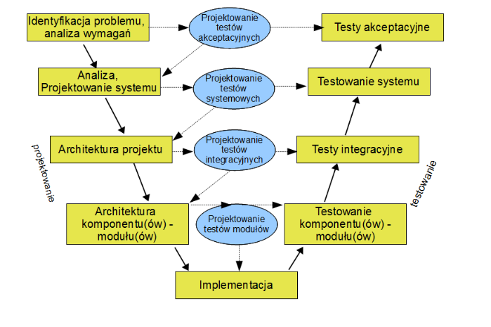
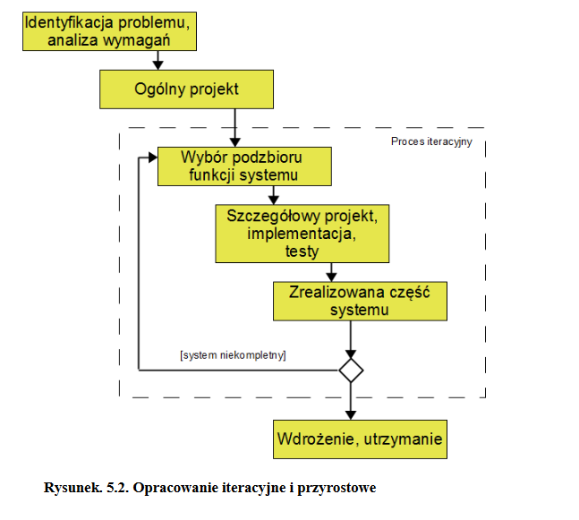
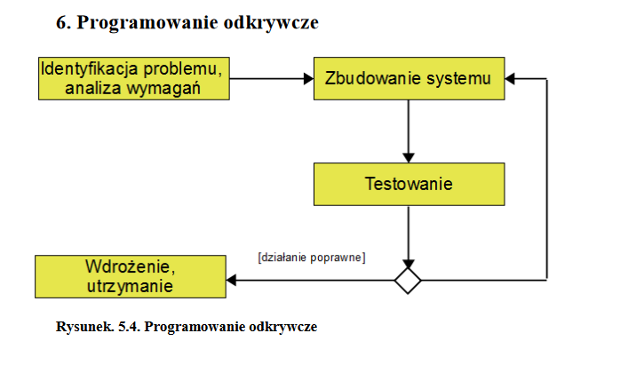
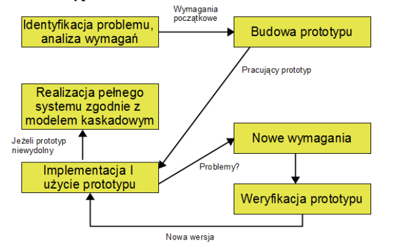
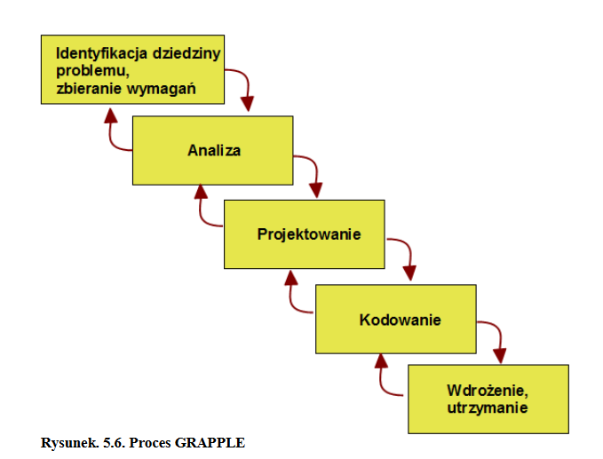

Inżynieria oprogramowania
===

# Wykład 9 Analiza, projektowanie i testowanie oprogramowania II

## Model V

### Analiza wymagań

- Zbieranie wymagań dotyczących przyszłego systemu poprzez analizę potrzeb użytkownika.
- Nie określa jak będzie zaprojektowane/zbudowane.
- Zazwyczaj generowany jest dokument zawierający opis wymagań systemu z punktu widzenie usera.
- Przygotowanie testów akceptacyjnych

### Analiza i projektowanie systemu

- Inżynierowie odpowiedzialni za projekt analizują wymagania klienta.
- Dobór technik odpowiednich do realizacji projektu.
- Przygotowanie ogólnej specyfikacji oprogramowania.
- Dokumentacja testowania systemu.

### Architektura projektu

- Zbiór wszystkich przewidywanych elementów logicznych przyszłego systemu wraz z artefaktami.
- Pełna lista modułów. Opis ich funkcjonalności, relacje między nimi itp..
- Konstrukcja testów integracyjnych

### Architektura komponentów

- Logicznie jak i fizycznie
- Niski poziom abstrakcji (komponenty, moduły)
- Szczegóły funkcjonalne logiki komponentu (modułu), wszystkie szczegóły interfejsów, kompletne API
- Wszystko opisane tak, żeby programista mógł zacząć pisać kod.

### Zalety modelu V

- W miarę dokładnie odzwierciedla zależności, jakie powinny łączyć kolejne etapy projektu.
- Bardzo wczesne utworzenie specyfikacji testowej.
- Jeden z najważniejszych modeli tworzenia oprogramowania.
- Mało szczegółowy i mało wydajny (???? WTF)
- daje obraz idealnego świata kooperacji między architaktami, programistami, testerami i klientami.

## Realizacja iteracyjna i przyrostowa

## Programowania odkrywcze

## Prototypowanie

### Cele

- Wykrycie nieporozumień pomiędzy klientami a twórcami systemu
- Wykrycie brakujących funkcji systemu
- Wykrycie trudnych do zaimplementowania usług
- Wykrycie braków w specyfikacji wymagań

- Prototypowania zwiększa koszt przedsięwzięcia, jednak prototyp nie musi być
    - w pełni ukończony
    - od początku niezawodny ani starannie przetestowany
    - działać szybko

### Zalety

- Lepsze poznanie potrzeb i wymagań użytkowników
- szybka demonstracja pracującej wesji systemu

### Wady

- Relatywnie wysoki koszt tworzenie prototypu
- niezadowolenie klienta, który czasami długo oczekiwał na gotowy system (???????)

### Metody prototypowania

- niepełna realizacja - sukcesywne uwzględnianie tylko cześci funkcji
- stosowanie języków wysokiego poziomu (???)
- wykorzystanie gotowych komponentów
- wykorzystanie generatorów UI

## GRAPPLE

- Metodologia w której wykorzystano wiele wcześniejszych idei projektowania aplikacji (np RUP)

### Struktura

- __Indentyfikacja problemu i zbieranie wymagań__
- __Analiza__
    - Dogłębne zrozumienie i zdefiniowanie problemu.
    - Określenie środków, które będą potrzebne do rozwiazania problemu
    - Wynikiem jest specyfikacja systemu, zawierająca opis wszystkich jego funkcji
- __Projektowanie__
    - Dopracowanie szczegółów
    - Tworzenie szczegółowego projektu każdego rozwiazania
    - Opis zależności między modułami
    - Sposoby wywołania funkcji
    - Diagnoza przypadków użycia
    - Wygląd formularzy
- __Kodowanie__
    - tworzenie kodu na podstawie wcześniej stworzonych diagramów klas i aktywności.
- __Wdrożenie__
    - testowanie aplikacji
    - integracja ze współpracującymi systemami

## XP - Programowanie ekstremalne

- Ma na celu wydajne tworzenie małych i średnich projektów wysokiego ryzyka, czyli takich, w których nie wiadomo co tak naprawdę należy wykonać i jak to prawidłowo przeprowadzić.
- Należy do metodyk zwinnych (Agile)

- Programista w centrum zainteresowanie (powiało renesansem)
- Korzystanie z wzorców architektonicznych, projektowych oraz idiomów
- Uznanie kodu za dokumentację projektu
- Ścisła współpraca programistów z klientem

### Model XP

- Określ cel
- Wykonaj działanie
- Odbierz informację zwrotną
- Skoryguj działania tak, aby kolejny efekt był bliższy sukcesowi

### Główne etapy XP

- Komunikacja w zespołach
- Prostota
- Informacja zwrotna (od klienta oraz na podstawie wyników testów)
- Odwaga w podejmowaniu i wdrażaniu kluczowych decyzji, wynikających z wysokiego profesjonalizmu, przy pełnej świadomości odpowiedzialności za podjęte decyzje.
