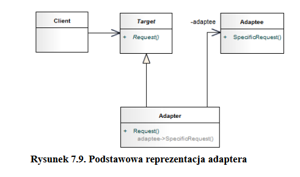
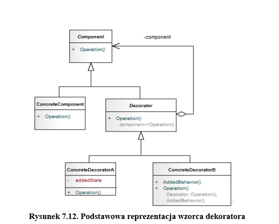
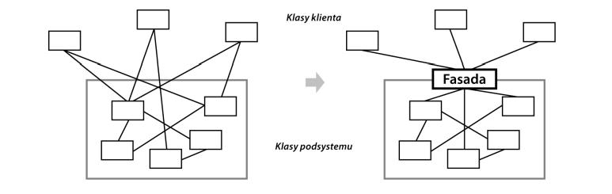
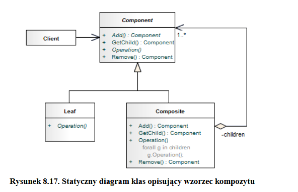
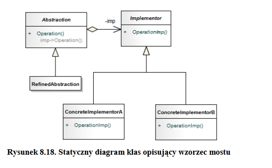
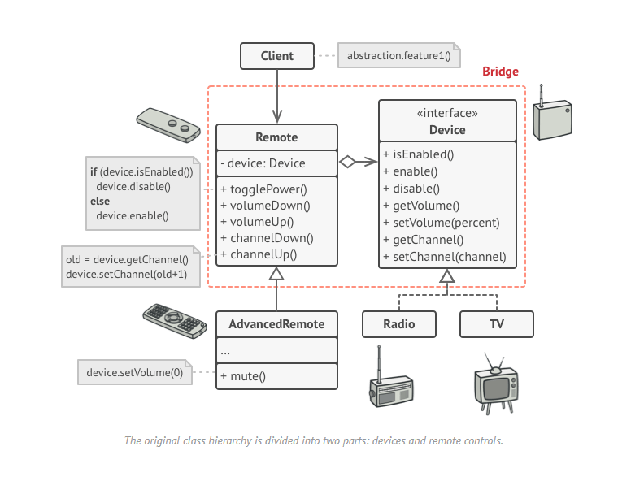
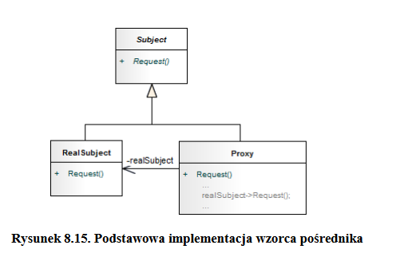
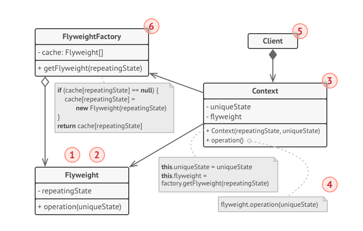

Inżynieria oprogramowania
===

# Wykład 11-14 Wzorce projektowe

### [LINK](https://refactoring.guru/design-patterns/catalog)

> Każdy  wzorzec  opisuje  problem  powtarzający  się
w danym środowisku i istotę rozwiązania tego problemu w taki sposób, że można wykorzystać
określone rozwiązanie milion razy i nigdy nie zrobić tego tak samo

## Podział wzorców

- __Wzorce analityczne__ - umiejscowione na poziomie opisu rzeczywistości
- __Wzorce architektoniczne__ - umiejscowione na poziomie integracji komponentów. Określają strukturę i zachowanie systemu jako całości
- __Wzorce projektowe__ - umiejscowionone na poziomie interakcji między klasami. Określają strukturę i zachowanie kompotentów oraz zestawów klas systemu
- __Wzorce programowania i idiomy__ - umiejscowione na poziomie języka programowania. Opisują rozwiązania dla konkretnych, często spotykanych problemów implementacyjnych.

## Podzial wzorców projektowych

- __Wzorce konstrukcyjne__ - wykorzystywane do pozyskiwania obiektów zamiast bezpośredniego tworzenia egzemplarzy klas
- __Wzorce strukturalne__ - pomagające łączyć obiekty w większe struktury
- __Wzorce operacyjne__ - służące do definiowania komunikacji między obiektami oraz kontrolowania przepływu danych w złożonym systemie

## Wzorce konstrukcyjne

### Budowniczy

- Oddziela tworzenie złożonego obiektu od jego reprezentacji, dzięki czemu ten sam proces konstrukcji może prowadzić do powstania róźnych reprezentacji
- Kiedy?
    - Algorytm tworzenia złożonego obiektu powinien być niezależny od konstrukcji części składowych tego obiektu i sposobu ich łączenia
    - Proces konstruowania powinien być uwzględnić róźne reprezentacje konstruowanego obiektu

### Metoda wytwórcza

- Określa interfejs do tworzenia obiektów, przy czym umożliwia podklasom wyznaczenie klasy danego obiektu. Metoda wytwórcza umożliwia klasom przekazanie procesu tworzenia egzemplarzy podklasom
- Kiedy?
    - Klasa nie może przewidzieć, których klas obiekty będzie kreować
    - Klasa żąda, aby jej podklasy specyfikowały tworzone przez nią obiekty
    - Klasy przekazują odpowiedzialność do dokładnie jednej z kilku podklas

### Prototyp

- Określa na podstawie prototypowego egzemplarza rodzaje tworzonych obiektów i generuje nowe obiekty przez kopiowanie tego prototypu
- Kiedy?
    - Egzemplarze klas, które należy tworzyć powinny być specyfikowane w czasie wykowania programu
    - Istnieje potrzeba uniknięcia budowania hierarchii klas
    - Stan obiektów klasy może przyjmować tylko jedną z kilku róźnych wartości

### Singleton

- Gwarantuje, że klasa będzie miała tylko jeden egzemplarz, i zapewnia globalny dostęp do niego
- Powinna być możliwe rozbudowywanie tego egzemplarza przez definiowanie podklas, a klienci powinni móc używać rozszerzonego egzemplarza bez modyfikowania swojego kodu

### Fabryka abstrakcyjna

- Udostępnia interfejs do tworzenia rodzin powiązanych ze sobą lub zależnych od siebie obiektów bez określenia ich klas konkretnych
- Kiedy?
    - System powinien być konfigurowany przy pomocy jednej z wielu rodzin obiektów
    - Grupa związanych ze sobą obiektów jest zaprojektowana tak, by te obiekty były razem używane
    - Istnieje potrzeba dostarczenia biblioteki klas, posługując się jedynie ich interfejsami, a nie implementacją

## Wzorce strukturalne

### Adapter

- Przekształca interfejs klasy na inny, oczekiwany przez klienta. Adapter umożliwia wspołdziałanie klasom, które z uwagi na niezgodne interfejsy standardowo nie mogą współpracować ze sobą

### Dekorator

- Dynamicznie dołącza dodatkowe obowiązki do obiektu. Wzorzec ten udostępnia alternatywny elastyczny sposób tworzenia podklas o wzbogaconych funkcjach

### Fasada

- Udostępnia jednolity interfejs dla zbioru interfejsów z podsystemu. Fasada określa interfejs wyższego poziomu ułatwiający korzystanie z podsystemów.

### Kompozyt

- Składa obiekty w struktury drzewiaste odzwierciedlające hierarchę typu część-całość. Wzorzec ten umożliwia klientom traktowanie poszczególnych obiektów i ich złożeń w ten sam sposób

### Most

- Oddziela abstakcję od jej implementacji, dzięki czemu można modyfikować te dwa elementy niezależnie od siebie
- Zamiana dziedziczenia na kompozycję -> abstrakcja deleguje pracę do implementacji

### Pełnomocnik (Proxy)

- Udostępnia zastępnik lub reprezentanta innego obiektu w celu kontrolowania dostępu do niego

#### Rodzaje proxy

- Pośrednik wirtualny (virtual proxy)
    - Wykorzystywany w sytuacji, gdzie obiekt, który trzeba zastąpić jest bardzo "ciężki"
    - Opóźnia proces tworzenia takiego obiektu, do czasu, gdy ten nie jest potrzebny
- Pośrednik zabezpieczający (protected proxy)
    - Zabezpiecza dostęp do obiektu
- Pośrednik zdalny (remote proxy)
    - Reprezentuje obiekt znajdujący się np. w innym komputerze (dostęp przez sieć)
    - Od strony klienta wszystkie odwołania od niego wyglądają na lokalne

### Pyłek

- Wykorzystuje współdzielenie do wydajnej obsługi dużej liczby małych obiektów
- Optymalizacja wykorzystania RAM
- Ogólnie polega na wydzieleniu części klasy, która jest niezmienna w trakcie życia obiektu np. tekstury

- 1: Wydzielona część klasy (niezmienna)
- 3: Klasa, z której wydzieliliśmy pyłek. Wszystkie obiekty tej klasy zawierają tylko referencję do pyłku.
